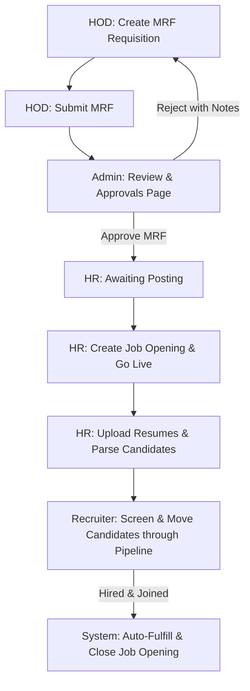

# 🚀 AI-Powered Automated Recruitment System (ATS)

> **Summer Internship Project @ AIA Engineering Limited**  
> A production-grade, full-stack Applicant Tracking System (ATS) and Recruitment Portal designed to streamline and automate the hiring lifecycle.

---

## 📌 Table of Contents
1. [Overview](#-overview)
2. [Recruitment Workflow](#-recruitment-workflow)
3. [Key Features](#-key-features)
4. [Role-Based Access Control](#-role-based-access-control)
5. [Technology Stack](#-technology-stack)
6. [Repository Links](#-repository-links)
7. [Internship Details](#-internship-details)
8. [Acknowledgements](#-acknowledgements)
9. [Project Demonstration](#-project-demonstration)

---

## 📖 Overview

The **AI-Powered Automated Recruitment System (ATS)** is a collaborative project developed to digitize, organize, and accelerate the recruitment cycle. Traditionally, recruitment involves manual tracking, disjointed communication, and physical paperwork. This platform centralizes all activities—from the initial Manpower Request Form (MRF) submission by Department Heads to candidate screening, interviewing, and final onboarding—into a single web application with secure, role-based workflows.

---

## 🔄 Recruitment Workflow

The system enforces a structured recruitment pipeline to ensure compliance, transparency, and tracking at every step:

### Process Flow Breakdown:
1. **Requisition (MRF):** HOD drafts and submits a detailed manpower request.
2. **Review & Approval:** Admin reviews the request and either approves it or sends it back to the HOD with feedback/reasons for rejection.
3. **Job Creation:** Approved requests move to HR, who launches the recruitment process.
4. **Resume Sourcing & Ingestion:** HR uploads candidate resumes and profile details for the opening.
5. **Applicant Pipeline:** Recruiters move candidates through stages (Screening, Interview, Offer).
6. **Auto-Closure:** Once the target candidate count is successfully hired, the system auto-closes the vacancy.

---

## ✨ Key Features

### 📝 Manpower Request (MRF) Creation
* **Sectioned Digital Form:** A comprehensive 4-part form covering:
  * **Position Details:** Title, department, reports to, proposed salary.
  * **Reasoning:** Defining if the vacancy is a new role or a replacement (and tracking who is being replaced).
  * **Job Description:** Defining role description, responsibilities, and expected outcomes.
  * **Criteria:** Required qualifications, preferred industry, experience level, and IT requirements.

### ✅ Multi-Stage Approval Workflow
* **Admin Review Terminal:** Dedicated board for admins to inspect MRFs.
* **Interactive Approvals:** Approve requests instantly or reject them with detailed feedback notes sent back to HODs.

### 💼 ATS Workspace & Candidate Pipeline
* **Split-Pane Pipeline Dashboard:** Recruiters can view live jobs on the left and drag/update candidate stages on the right.
* **Stage Tracking:** Seamlessly move candidates from **New ➔ Screening ➔ Shortlisted ➔ Interview Scheduled ➔ Offered ➔ Joined ➔ Rejected**.
* **Resume Ingestion:** Single or batch resume uploads to populate candidate profiles.

### 🎯 Auto-Fulfillment & Closing
* **DOJ Registry:** Registers candidate Date of Joining (DOJ) upon hiring.
* **Automatic Fulfillment:** Instantly changes the status of a job opening to `Fulfilled` (Closed) once the target number of vacancies is met.

---

## 👥 Role-Based Access Control

The application implements strict role-based access to safeguard data integrity and tailor the user experience:

| User Role | Description & Permissions | Key Views |
| :--- | :--- | :--- |
| **👨‍💼 Department Head (HOD)** | Can create, save, edit, and track their department's MRFs. | My MRFs, Drafts |
| **🛡️ Admin** | Oversees all requisitions. Holds absolute power to approve or reject MRFs. | Admin Approvals Board |
| **💼 HR / Recruiter** | Creates job listings from approved MRFs, uploads resumes, and moves candidates through stages. | ATS Workspace, Resume Ingestion |
| **🎤 Interviewer** | Views scheduled interviews, candidate details, and submits interview evaluations. | Interviewer Dashboard |
| **👤 Candidate** | Standard public portal to apply for jobs and check application progress. | Job Application, Status Portal |

---

## 🛠️ Technology Stack

### Frontend (Client)
* **React.js (v18):** Declarative component-based UI development.
* **Vite:** High-performance local development build tool.
* **Tailwind CSS (v3) & PostCSS:** Utility-first CSS styling for modern, responsive layouts.
* **React Router DOM (v6):** Client-side routing and middleware-like role protection.
* **Axios:** API integration layer with credentials and interceptors.

### Backend (Server)
* **Node.js & Express.js:** Fast, minimalist web framework for routing and API controllers.
* **MongoDB & Mongoose:** Document database storing schemas for MRFs, candidates, users, and job listings.
* **JWT (JSON Web Tokens):** Secure, stateless authentication for role-protected API endpoints.
* **REST APIs:** Structured endpoints handling status flows and data changes.

---

## 📂 Repository Links

* **Frontend Client Repository:** [GitHub - hr-portal-client](https://github.com/Bhavikapatel06/hr-portal-client)
* **Backend Server Repository:** [GitHub - hr-portal-server](https://github.com/Bhavikapatel06/hr-portal-server)

---

## 🏢 Internship Details

* **Company:** AIA Engineering Limited
* **Duration:** One Month (Summer Internship)
* **Team:** Developed collaboratively by a team of engineering interns.

---

* **Demo Video:** 
